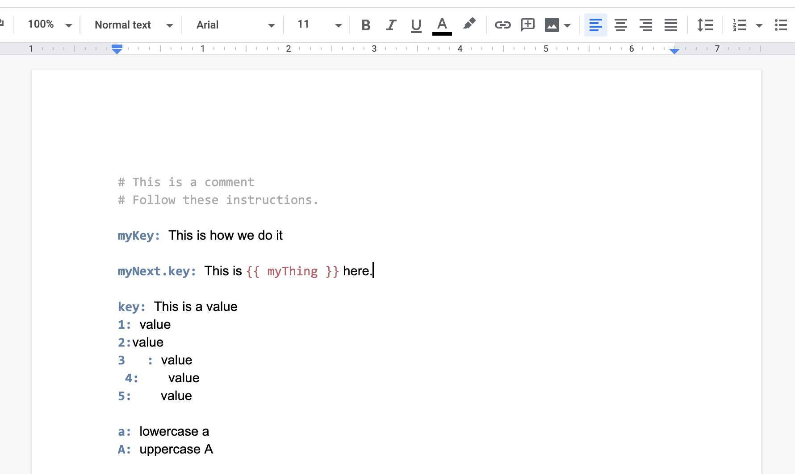
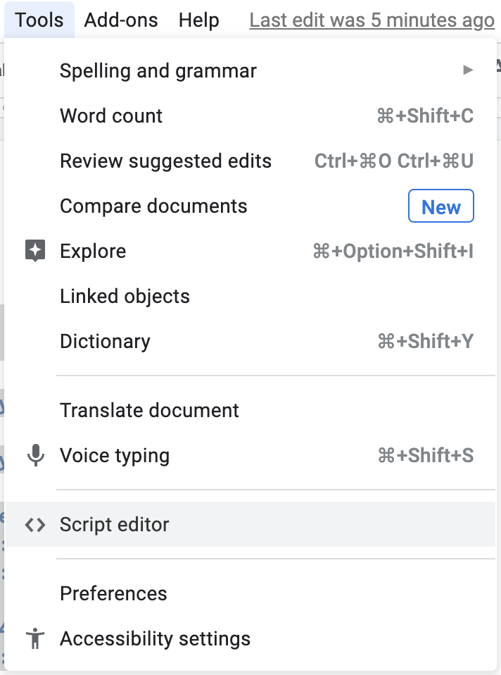
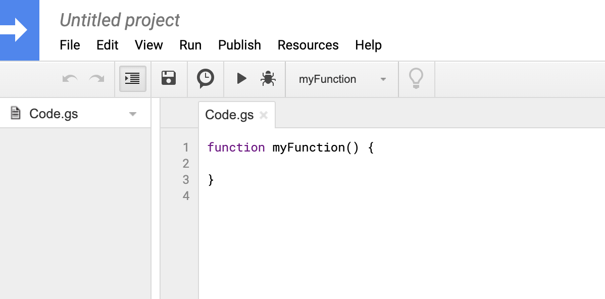
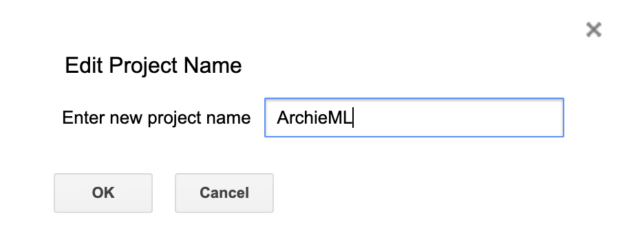
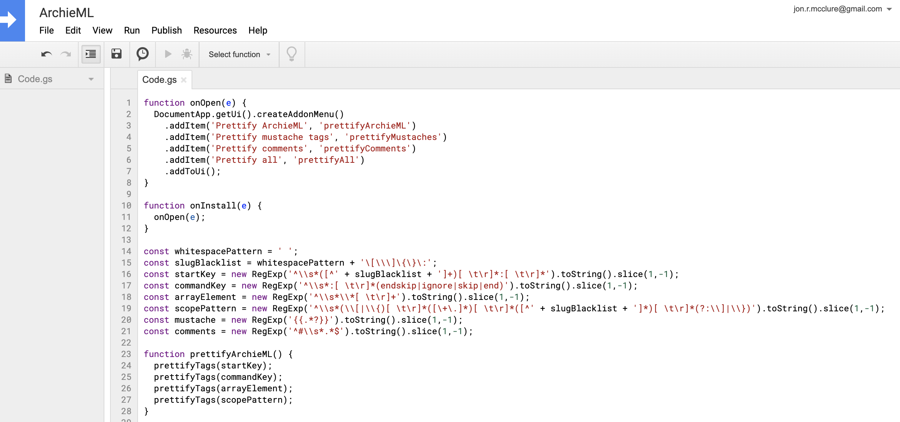
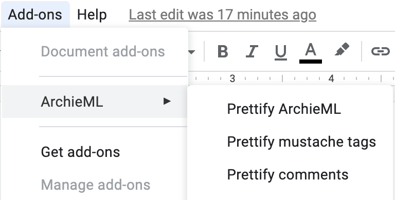

# archieml-prettifier

Google Apps Script to prettify [ArchieML](http://archieml.org/) formatted docs.

### To use

*Fair warning, Google Apps Scripts is a terrible development environment. These instructions are tedious and must be done for __every__ doc you want to format.*

---

1. Open the Google Doc you want to prettify and under the `Tools` menu select the `Scripts editor` option.

2. This will open up a new window for a Google Apps Script Project.

3. Click the `Untitled project` name in the upper left and rename your project **ArchieML**.

4. Copy the code from the `prettifyArchieML.gs` file in this repo and use it to replace the code in your `Code.gs` file in the Apps Script Editor.

5. Save the project and close the Apps Script window.

6. Go back to your document and refresh the page. Under `Add-ons` you'll now see a `ArchieML` option. Click on any of the options.

7. Follow the dialogue to authorize the app. (You'll be warned the app isn't verified, but nevermind.)

8. Once you've authorized the script, you can now use the Add-on options.
